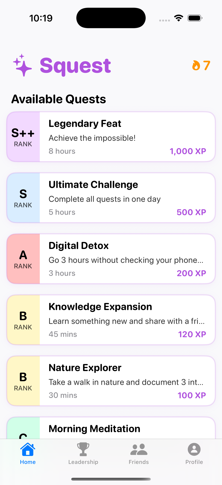
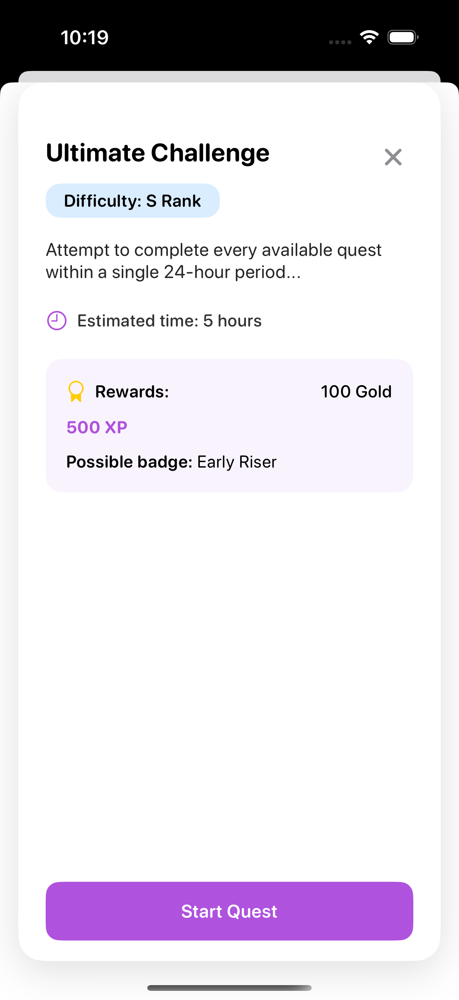
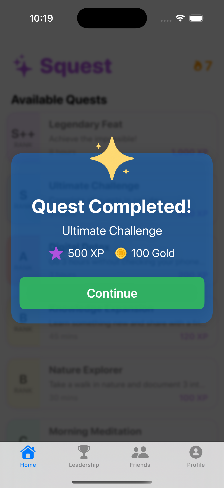
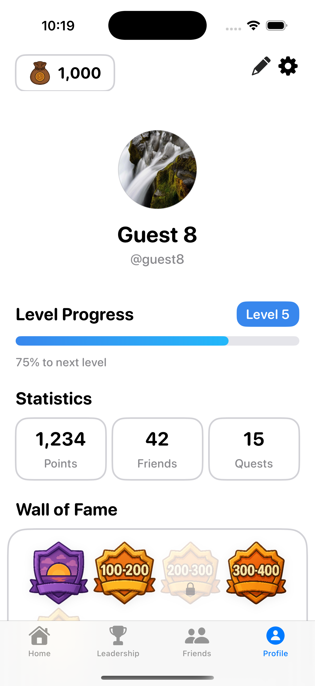
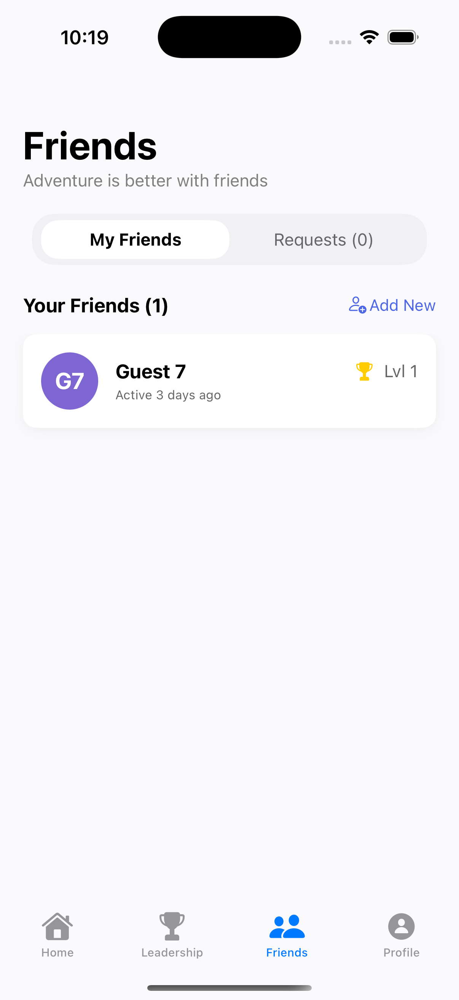
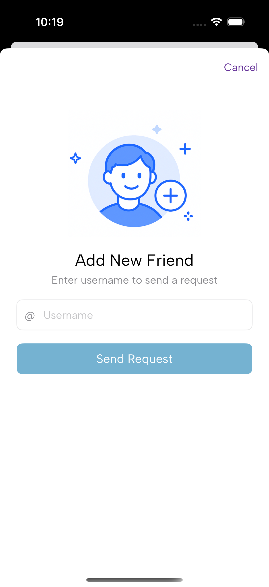
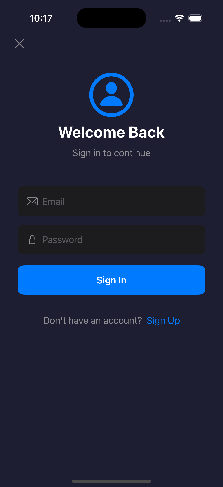
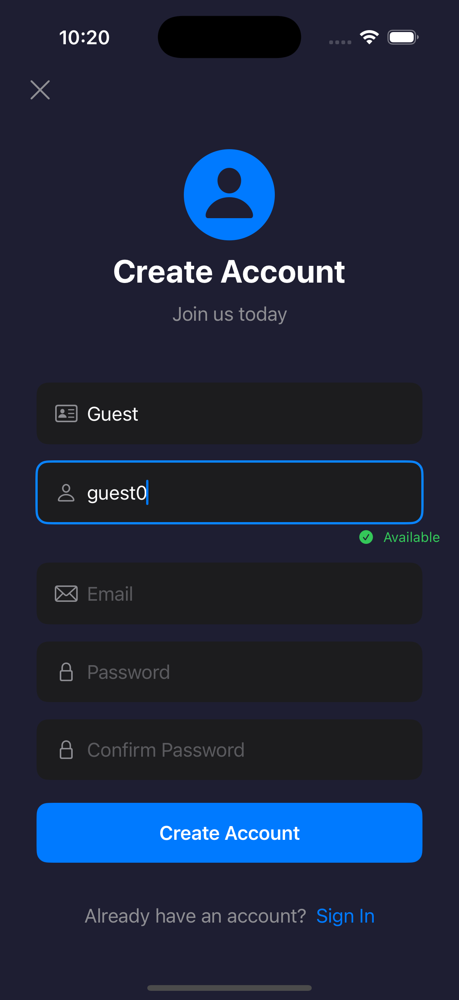
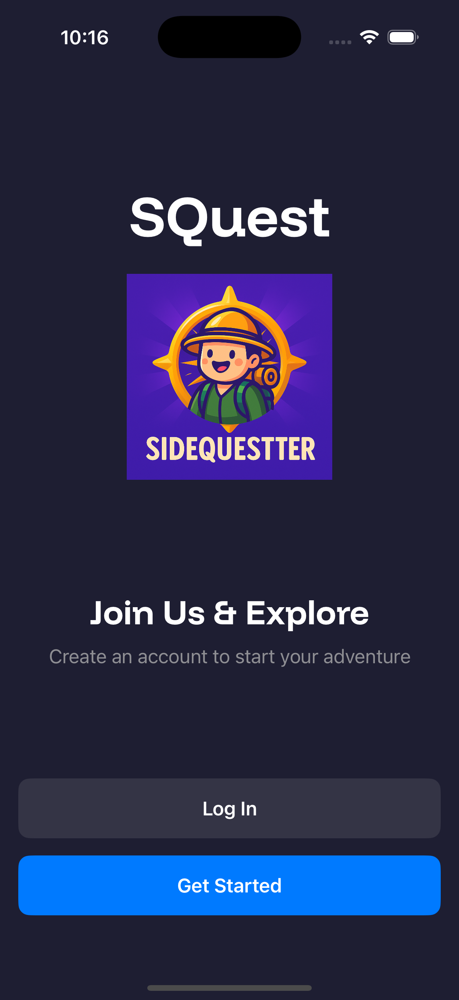
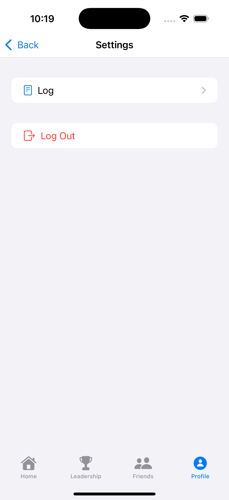

# 📱 Squest: Gamified Life Improvement App

Squest is an iOS app that turns daily self-improvement into a **gamified quest system**, helping users build habits and explore new experiences through **adventure-themed engagement**.  
This project showcases **end-to-end product development and management**, from roadmap creation and market research to feature delivery and iteration.

---

## 🗓️ Project Timeline & Accomplishments

| Phase | Focus | Key Achievements |
|------|-------|------------------|
| **1: Concept & Planning** | Defined vision, goals, and success metrics | Drafted [**Project Roadmap**](https://docs.google.com/document/d/1dqEq1c8J7r3ICQss6aJv8rx1gu8-mCfdxQ2ftKTygAM/edit?usp=sharing) and **Specification Documents** ([Database Design & Functionality Specifications](https://docs.google.com/document/d/18zvXryKSbMnmnkE7SpN0-7GGRC-hgQdlE73a-gbOhoI/edit?usp=sharing), [UI Planning](https://docs.google.com/document/d/1bpQtexOqqc3dchVOuaGm595Wm-2ToM_74Cb4g7t0KAo/edit?usp=sharing)) |
| **2: Market Research** | Competitive analysis and audience insights | Created [**Market Importance Report**](https://docs.google.com/document/d/1tMLW8n0SGf-t5oIPhAMnyPan17_z2fVL5479Zk0yHTg/edit?usp=sharing) with competitor review |
| **3: UI/UX Design** | Initial sketches and branding | Delivered **UI Sketches** and **Figma Designs** |
| **4: Feedback & Iteration** | Early user testing | Conducted interviews and revised app flow |
| **5: MVP Development** | Core feature build-out | Implemented **signup/login, quests, profiles, and friends** (See below for app screenshots)|
| **6: Growth Strategy** | Marketing plans and monetization | Built **Marketing & Monetization Plans** for scaling |

> **Impact:** Demonstrates ability to manage a **multi-phase project** from concept to functional product, documenting milestones and iterating based on research and user feedback.

---

## 🎯 Project Highlights

- **Lifecycle Management:** Planned, documented, and delivered the app over multiple stages.  
- **Roadmap-Driven Execution:** Created structured **6-phase roadmap** with deliverables for each milestone.  
- **User-Centered Design:** Conducted research and early testing to refine user experience.  
- **Full-Stack Engineering:** Built SwiftUI app with Supabase BaaS backend.  
- **Gamified Experience:** Implemented streaks, XP, leaderboards, and daily quest systems.

---

## 🛠️ Tech Stack

| Layer                   | Technology Used                          |
|-------------------------|-----------------------------------------|
| **Frontend (iOS)**      | SwiftUI, UIKit                          |
| **Backend (BaaS)**      | Supabase (Auth, Database, API)          |
| **Database**            | PostgreSQL (Managed by Supabase)        |
| **Version Control**     | Git & GitHub                            |
| **Project Tools**       | Figma, Canva, Notion, Trello, Google Docs |

---

## 🧠 Skills Demonstrated

- **Project Management & Planning**  
  - Built a 6-phase **project roadmap** with clear deliverables for each milestone.  
  - Authored **technical specifications** and **market research reports** to guide development.  
  - Prioritized features and created iterative feedback loops with stakeholders.  

- **UI/UX Design & Prototyping**  
  - Designed wireframes and a **high-fidelity Figma prototype** for app flow and branding.  
  - Conducted **user interviews** and usability testing to refine interface decisions.  
  - Established a **consistent design system** with color palettes, typography, and iconography.  

- **iOS Development**  
  - Built the app in **SwiftUI** with modular, reusable components.  
  - Implemented **authentication flows, profile management, quest tracking, and friend features**.  
  - Integrated animations, streak indicators, and progress bars for gamification.  

- **Backend-as-a-Service Integration**  
  - Used **Supabase** for authentication, database, and storage to create a scalable backend.  
  - Designed database schema and optimized queries for leaderboard, friend activity, and quests.  
  - Implemented **secure auth tokens** and role-based data access policies.  

- **Marketing & Growth Strategy**  
  - Created **social media content plans** and growth metrics to build awareness pre-launch.  
  - Drafted a **monetization strategy** and product release plan.  
  - Conducted competitor analysis to find market positioning opportunities.  

---

## 🧩 Core Features (Currently Supported)

- 🔐 **User Accounts**: Signup, login, and logout  
- 🧭 **Quest Selection**: Browse, select, and complete quests  
- 👤 **Profile Management**: View and edit user profile  
- 🤝 **Friends System**: Add friends and view friend activity  
- 🎮 **Gamification**: Streak tracking, XP, and quest history  

---

## 📸 Screenshots

| Quest Page | Quest Details | Quest Completed |
|------------|---------------|----------------|
|  |  |  |

| Profile | Friend List | Add New Friend |
|---------|------------|----------------|
|  |  |  |

| Log In | Sign Up | Welcome Page |
|--------|---------|--------------|
|  |  |  |

| Settings |
|----------|
|  |

---

## 🔥 Future Improvements

- 📊 Advanced leaderboards and leagues  
- 💬 Messaging and group challenges  
- 🌍 Cross-platform (iOS/Android) support  
- 🔐 Enhanced security protocols  
- 🎨 Lottie animations and richer UI themes  
